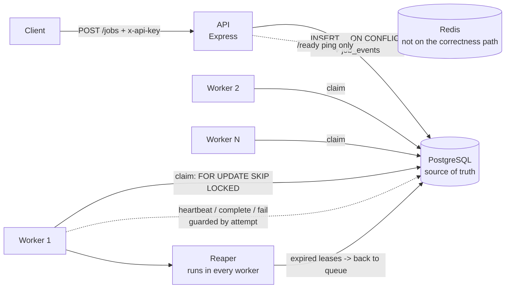
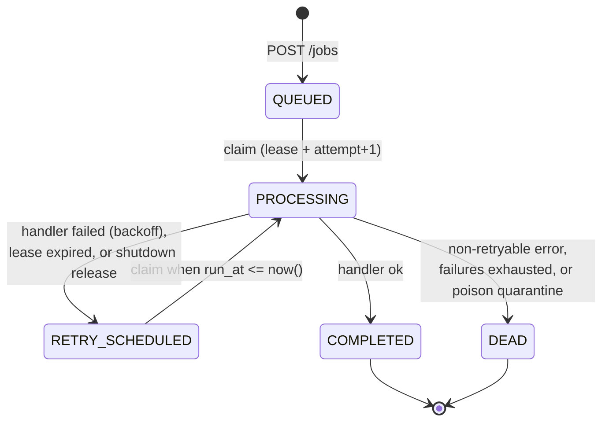
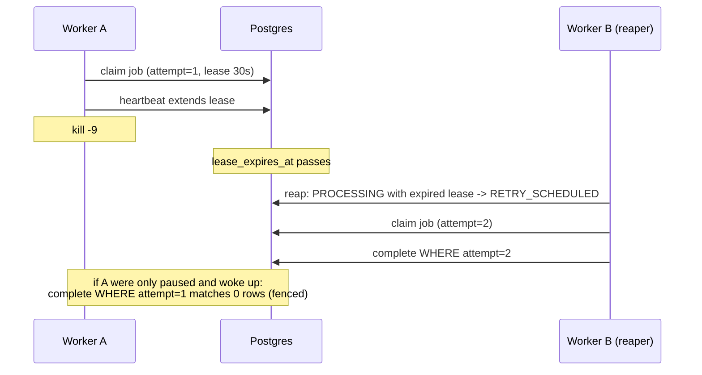

# TaskFlow

A distributed background-job engine: applications submit jobs over HTTP, and a
fleet of worker processes runs them with leases, retries and crash recovery.
Built from scratch on Node.js and PostgreSQL (no BullMQ / pg-boss), because the
queue, lease, retry and recovery logic is the point.

> **The one claim this project proves:** a worker can crash halfway through a
> job, and the system recovers without losing the job and without incorrectly
> processing it twice. A chaos test `kill -9`s a real worker to demonstrate it.

<!-- TODO (you): rewrite this intro in your own words: why you built it and what you learned. -->

## Status

Working: idempotent submission, Postgres-based claiming, leases + heartbeats,
fencing, reaper, retries with backoff and jitter, dead-letter state, graceful
shutdown, execution idempotency, containerised stack, 12 chaos tests.

Not built yet (see `docs/AUDIT.md` and `manual_work.md`): metrics/Grafana,
list/cancel/DLQ endpoints, priority/delay fields in the API, tenants and scoped
keys, CI, load tests. Nothing here claims those exist.

## Architecture



The queue **is** the `jobs` table. Redis holds no job state, so flushing or
losing it cannot lose a job (tested).

### Life of a job



Every transition is one guarded SQL `UPDATE` in `src/jobs/repository.js` and
writes a row to `job_events` in the same transaction.

### A crash, step by step



## Key design decisions

Full reasoning is in [`docs/DESIGN.md`](docs/DESIGN.md).

- **`SELECT ... FOR UPDATE SKIP LOCKED` claiming.** Claim and the `PROCESSING`
  update are one statement, so N workers never take the same job. A locked row
  is skipped, not waited on.
- **Postgres is the queue.** Insert-then-push-to-Redis is a dual write that can
  lose jobs on a crash. Removing the second write removes the problem. Cost:
  polling latency (`POLL_INTERVAL_MS`, default 500 ms).
- **Leases, not locks.** A worker must heartbeat to keep its job; expiry is the
  failure detector. All lease decisions use database time (`now()`), never
  worker clocks.
- **Fencing.** `attempt` rises on every claim, and every worker write is guarded
  `WHERE status='PROCESSING' AND locked_by=$w AND attempt=$n`. A stalled worker
  that wakes up late matches zero rows and cannot overwrite the new owner.
- **Three counters.** `attempt` (fencing token) is not the retry budget.
  `failure_count` counts handler failures and is the only thing `max_attempts`
  limits; `recovery_count` caps lease-expiry recoveries so a poison job
  cannot crash-loop the fleet. Crashes and deploys never spend retry budget.
- **At-least-once + idempotent execution.** Exactly-once is impossible. Handlers
  may run twice; `ctx.once(key, fn)` records effects in an `effects` table so a
  redelivery skips them. **For real external effects (email, payments) you must
  also pass the provider an idempotency key** such as `<jobId>:<effectKey>`.
- **Idempotent submission.** `INSERT ... ON CONFLICT (idempotency_key) DO
  NOTHING` on a UNIQUE constraint; 10 concurrent identical submits make 1 job.
- **Retries** use exponential backoff with full jitter, persisted as `run_at`,
  so no worker ever sleeps and a dead worker cannot lose a retry.

## Run it

Requirements: Docker, Node.js 20+ (Node 22 in the image).

```bash
cp .env.example .env        # then set strong POSTGRES_PASSWORD and API_KEY
docker compose up -d --build            # postgres, redis, migrations, api, worker
docker compose up -d --scale worker=3   # more workers
docker compose down                     # stop (add -v only to DELETE the data)
```

Compose refuses to start without `POSTGRES_PASSWORD` and `API_KEY`; nothing
secret is hard-coded. Services publish on `127.0.0.1` only.

Submit and inspect a job:

```bash
curl -s -X POST localhost:3000/jobs \
  -H "x-api-key: $API_KEY" -H "content-type: application/json" \
  -d '{"type":"send_email","payload":{"to":"a@b.c"},"idempotencyKey":"order-42"}'
# -> {"jobId":"...","status":"QUEUED"}   (same key again -> 200, same jobId)

curl -s localhost:3000/jobs/<jobId> -H "x-api-key: $API_KEY"
curl -s localhost:3000/ready      # {"ready":true,"degraded":false,"checks":{...}}
```

| Endpoint | Purpose |
|---|---|
| `POST /jobs` | submit (`type`, `payload`, optional `idempotencyKey`); 202 new, 200 duplicate |
| `GET /jobs/:id` | job status (public fields only) |
| `GET /health` | liveness |
| `GET /ready` | readiness: Postgres decides; Redis down shows `degraded: true` |

Job types: `send_email`, `process_image` (demo handlers in `src/jobs/handlers.js`).

### Configuration

All via environment (see `.env.example`). Worker settings are validated at
startup and it refuses nonsense (e.g. heartbeat above half the lease).

| Variable | Default | Meaning |
|---|---|---|
| `WORKER_CONCURRENCY` | 4 | jobs one worker runs at once |
| `LEASE_MS` / `HEARTBEAT_INTERVAL_MS` | 30000 / LEASE/3 | lease length / how often it is extended |
| `REAP_INTERVAL_MS` | 5000 | reaper scan interval |
| `SHUTDOWN_GRACE_MS` | 25000 | SIGTERM drain time; compose `stop_grace_period` is 35 s |
| `MAX_LEASE_RECOVERIES` | 10 | lease expiries before a job is quarantined to `DEAD` |
| `PG_POOL_MAX` | 10 | Postgres pool size per process |

## Develop and test

```bash
npm ci
npm run test:db:setup      # once: creates and migrates the taskflow_test database
npm run lint               # ESLint + Prettier check
npm test                   # unit tests
npm run test:integration   # real Postgres
npm run test:chaos         # kills real processes; needs Docker running
```

Tests **never** use your dev database: they run against `TEST_DATABASE_URL`
(`taskflow_test`), and a guard refuses any database name not ending in `_test`.

### The chaos suite (`tests/chaos/`)

| Scenario | What it proves |
|---|---|
| `kill -9` a worker mid-job | reaper reclaims it; completes on attempt 2; side effect applied once |
| Lost ack (killed after the effect, before `COMPLETED`) | redelivered, but the effect is not repeated |
| Zombie worker with a stale attempt | complete / fail / extend are all rejected by fencing |
| SIGTERM mid-job (worker in a container) | finishes, exits 0; if the grace is too short, the job is released at once |
| Postgres connections severed mid-job (single drop and 5 s storm) | one completion, one effect, worker survives |
| Lease lost while running | handler is aborted; the stale run produces no side effect |
| Redis `FLUSHALL` / Redis stopped | jobs still accepted and processed; `/ready` says degraded |

Last full run: 5 unit, 22 integration, 12 chaos tests passing; `npm audit`: 0
vulnerabilities.

## Repository layout

```
src/api.js              HTTP API
src/worker.js           worker: lanes, heartbeat, reaper, graceful shutdown
src/jobs/repository.js  every job state transition (claim, complete, fail, release, recover, reap)
src/jobs/effects.js     ctx.once() execution-idempotency ledger
src/jobs/backoff.js     exponential backoff with jitter
migrations/             node-pg-migrate (up + down)
tests/{unit,integration,chaos}/
docs/                   DESIGN.md (the why), AUDIT.md (findings), PROGRESS.md, INTERVIEW_QA.md
```

## Trade-offs and known limitations

Honest list; severities and the full set are in [`docs/AUDIT.md`](docs/AUDIT.md).

- **Polling, not push.** Claim latency is up to `POLL_INTERVAL_MS`, and every
  worker queries Postgres. Fine for background jobs; a wake-up signal is future work.
- **`ctx.once()` is claim-then-act.** A crash between claim and effect can
  *miss* an effect (we prefer that to duplicating one). Provider idempotency
  keys cover the rest.
- **Strict priority.** `priority_rank` orders claims, so sustained HIGH load can
  starve LOW. No aging yet, and the API does not expose priority or delay yet.
- **A handler that ignores its `AbortSignal`** keeps running after a timeout, so
  real concurrency can exceed the limit. Untrusted code needs process isolation.
- **Security is basic:** one shared API key (compared in constant time), per-IP
  in-memory rate limit, no tenants/scopes, no TLS, single DB superuser.
- **No retention:** `jobs` and `job_events` grow forever.
- **Redis is currently vestigial** (a `/ready` ping only); it is kept for a
  future wake-up signal / shared rate limiting or should be removed.
- **Observability is minimal:** plain-text logs; no metrics, tracing or dashboard yet.
- **Performance is unmeasured.** No load test has been run, so this README makes
  no throughput claims.
